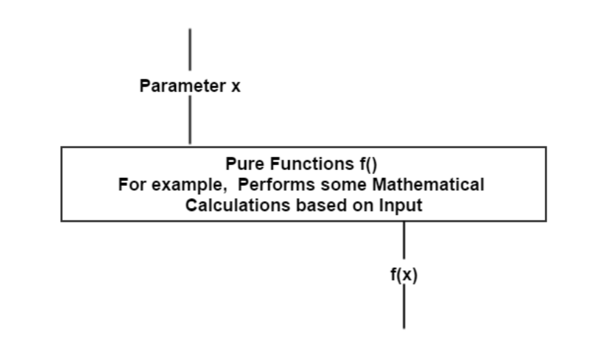

# pure functoin

웹 사이트나 응용 프로그램은 코드를 작성하다보면 필연적으로 어떤 종류의 버그가 포함됩니다. 이런 특징은 JavaScript에 국한되지 않고 거의 모든 언어에서 공유됩니다. 응용 프로그램에 버그가 발생할 가능성을 완전히 배제하는 것은 매우 까다로운 일입니다. 그러서 우리는 버그를 줄이기 위한 최선의 방법을 찾아 코드를 작성해야 합니다.

## 1. 함수란 무엇인가?

프로그래밍에서 함수는 인자가 입력되면 그 결과로 반환 값을 출력하는 방식이다.

함수는 몇 가지 목적을 갖는다.

- Mapping: 함수는 주어진 입력 값을 기반으로 출력 값을 반환한다. 즉, 함수에서 입력 값과 출력 값은 매핑된다.
- Procedures: 함수는 호출된 후 일련의 절차를 갖는다. 이러한 과정을 프로그래밍에서는 procedural programming라고 부른다.
- I/O: 일부 함수는 화면, 스토리지, 시스템 로그 또는 네트워크와 같은 시스템의 다른 부분과 통신하기 위해 존재합니다.

## 2. Mapping

pure function은 모두 Mapping에 관한 것입니다. 함수는 입력 인자를 반환 값에 매핑합니다. 즉, 각 입력에 대한 출력이 있습니다. 

'Math.max()'는 숫자를 인자로 받아 가장 큰 수를 리턴합니다.

    Math.max (2, 8, 5); // 8

이 예제에서 '2,8,5'은 입력 값입니다. 

이 함수에서 같은 입력값을 받는다면 외부 코드가 어떤 식으로 변화 하든지 항상 같은 결과 값을 갖게 됩니다. 

두번째 예시로 직접 코드를 작성해 보겠습니다.

     const double = number => number * 2;

이 결과는 어떠한 순간에도 입력에 대한 값을 두배로 반환합니다.

이 경우에 'console.log(double(5))'의 값은 '10'입니다.

즉, console.log(double(5))'의 값은 'console.log(10)'으로 대체될 수 있습니다. 

이것은 이 순수 함수의 특징이며 만약 함수에 side-effect가 있다면 불가능한 일입니다.

## 3. Pure function

순수 함수를 살피기 전에 비순수 합수를 먼저 살펴보겠습니다. 

### example

    function mouseOnLeftSide(mouseX) {
        return mouseX < window.innerWidth / 2;
    }
    
    document.onmousemove = function(e) {
        console.log(mouseOnLeftSide(e.pageX));
    };

mouseOnLeftSide()X 좌표를 확인하여 창 너비의 절반보다 작은 지 확인합니다. 마우스가 왼쪽에 배치하면 반환값은 true가 됩니다. 이것은 순수함수인가요?

mouseOnLeftSide()순수 함수는 아닙니다. 함수의 본문 내에서 명시 적으로 제공되지 않은 값을 참조하기 때문입니다.

    return mouseX < window.innerWidth / 2;

이 함수는 mouseX 가 주어 졌지만 window.innerWidth 는 주어 지지 않았습니다 . 이것은 함수가 주어진 데이터에 접근하기 위해 접근하고 있음을 의미하므로 순수하지는 않습니다.

이 함수에는 치명적인 단점이 있습니다.

만약, 사용자가 창 크기가 500 픽셀보다 작 으면 기능이 올바르지 않다는 버그 보고서를받는다고 상상해보십시오. 이걸 어떻게 시험할까요?

- 문제를 발견 할 때까지 브라우저를 로드하고 마우스를 움직여 수동으로 테스트 할 수 있습니다.
- 버그를 추적 할뿐만 아니라 다시는 발생하지 않도록 단위 테스트를 작성할 수 있습니다.

이 버그가 반복해서 발생하지 않도록 두 번째 옵션을 선택한다고 생각해 봅시다. 이제 우리는 새로운 문제에 직면하게 됩니다. 우리는 어떻게 테스트를 올바르게 설정합니까? 창 너비를 500 픽셀 미만으로 설정하여 테스트를 설정해야 하지만 어떻게 해야 합니까? 이 함수는 window.innerWidth 를 사용하고 특정 값에 있는지 확인하는 것이 쉽지 않을 것입니다.

이 함수를 순수 함수로 리펙토링 한다면 다음과 같습니다.

    function mouseOnLeftSide(mouseX, windowWidth) {
        return mouseX < windowWidth / 2;
    }
    
    document.onmousemove = function(e) {
        console.log(mouseOnLeftSide(e.pageX, window.innerWidth));
    };

windowWidth의 인자가 함수를 통해서 들어왔습니다. 이것은 순수 함수와 비 순수 함수를 나누는 굉장히 큰 차이입니다. window.innerWidth에 의존적인 코드를 명시적인 인자를 입력 받았기 때문에 테스트하기 좋은 코드로 변하였습니다.

### example

    function changeElementToRed() {
        var foo = document.getElementById('foo');
        foo.style.backgroundColor = "red";
    }
    
    changeElementToRed();

이 코드에는 두 가지 문제가 있습니다.

1. 이 함수는 전혀 재사용 할 수 없습니다. 특정 DOM 요소에 직접 연결되어 있습니다. 다른 요소를 변경하기 위해 재사용하고 싶다면 불가능합니다.
2. 이 함수는 순수하지 않기 때문에 테스트 하기 어렵습니다. 이를 테스트하기 위해 우리는 일반적인 요소가 아닌 특정 ID를 가진 요소를 만들어야 합니다.

위의 두 가지 점을 감안할 때 이 함수를 다음과 같이 다시 작성합니다.

    function changeElementToRed(elem) {
        elem.style.backgroundColor = "red";
    }
    
    function changeFooToRed() {
        var foo = document.getElementById('foo');
        changeElementToRed(foo);
    }
    
    changeFooToRed();

이제는 changeElementToRed() 함수가 특정 DOM 요소에 묶이지 않게 변경됐습니다.

하지만 여전히 changeElementToRed() 함수를 순수 함수 입장에서 바라보면 불완전하게 보입니다. 이것을 피할 수는 없지만 순수 함수를 사용하면 가독성, 재사용 성 및 테스트 가능성이 향상 될 수있는 기회를 발견 할 수 있습니다. 

여기서 중요한 점은 비순수 함수를 최소화 하는 것이 더 견고하고 버그가 적은 코드를 만들 수 있다는 것입니다.

다시 한 번 순수 함수의 특징은 다음과 같습니다.

- 함수에 같은 값을 입력한다면 항상 같은 값이 반환됩니다. 반환값은 오직 입력 값에만 영향을 받습니다.
- side-effect가 존재하지 않습니다.
- 테스트하기 좋은 코드이다.

이 특징으로 인한 장점은 다음과 같습니다. 

- 주어진 함수의 결과를 항상 예측할 수 있습니다.
- 테스트가 쉽습니다.

순수 함수의 또 다른 특징은 참조 값의 이전 상태를 변경하지 않는 것입니다. immutable한 데이터를 유지하여 프로그램의 오류를 최소화할 수 있습니다. 

### example

    let arr = [1, 2, 3, 4, 5, 6];
    
    even = arr.filter(function (element) {
        return element%2 === 0;
    });
    console.log(even); //[2,4,6]
    console.log(arr); //[1,2,3,4,5,6]

이러한 이유로 순수 함수를 선호하는 것이 좋습니다. 순수 함수를 사용하여 프로그램 요구사항을 해결하는 것이 현실적으로 가능하다면 다른 옵션보다 이 방식을 우선 선택해야 합니다.